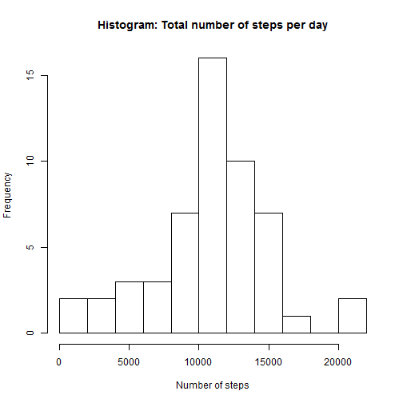
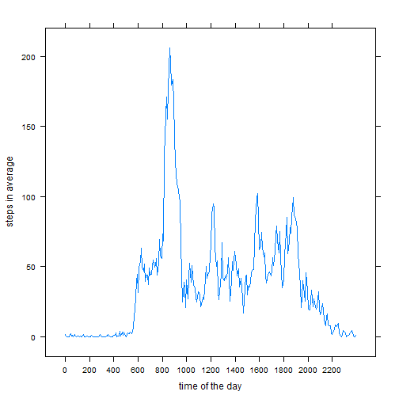
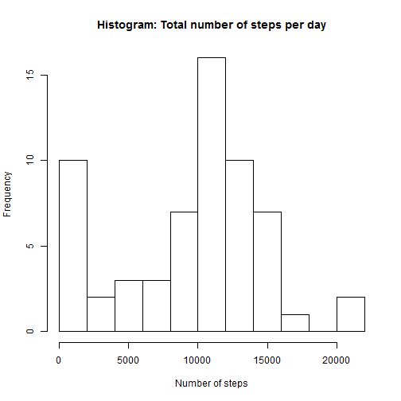
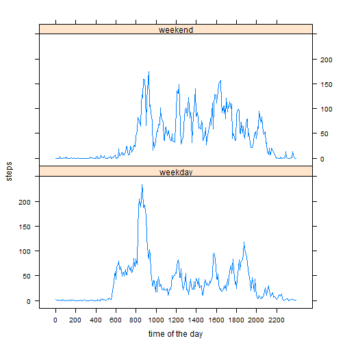

# Reproducible Research:
## Programming Assignment 1:
In this document i describe the steps i did and show the code i used to analyse the given data.
I used R version 3.2.2., my OS is Windows 10.
As a first task the data has to be imported and processed:


### Loading and pre-processing the data

To import the data the path has to be set. I have changed the class of the date-variable from factor to date. Additionally i have also changed the interval-variable from integer to factor as it is not really a continous variable, but an ordinal number representing the time.
I haven´t changed it explictly into a timestamp as this is the exploratory phase and i find it very easy to handle it that way.s

```r
#setwd("C:/Coursera/Reprod/")
library(lattice)
tab3l_raw <- read.csv("activity.csv")
tab3l_raw$date <- as.Date(tab3l_raw$date)
tab3l_raw$interval <- as.factor(tab3l_raw$interval)
```
After loading and preprocessing we want to answer the following question:

### What is the average daily activity pattern?

For this question we firstly discard all rows which have a missing value in any column. To do that the complete.cases-function is used. The data is stored in a new variable 'tab3l' as we might need the (almost) raw data afterwards.
At first we show the total number of steps per day.

```r
tab3l <- tab3l_raw[complete.cases(tab3l_raw),]
total_per_day <- tapply(tab3l$steps, tab3l$date,sum,na.rm=T)
total_per_day
```

```
## 2012-10-02 2012-10-03 2012-10-04 2012-10-05 2012-10-06 2012-10-07 
##        126      11352      12116      13294      15420      11015 
## 2012-10-09 2012-10-10 2012-10-11 2012-10-12 2012-10-13 2012-10-14 
##      12811       9900      10304      17382      12426      15098 
## 2012-10-15 2012-10-16 2012-10-17 2012-10-18 2012-10-19 2012-10-20 
##      10139      15084      13452      10056      11829      10395 
## 2012-10-21 2012-10-22 2012-10-23 2012-10-24 2012-10-25 2012-10-26 
##       8821      13460       8918       8355       2492       6778 
## 2012-10-27 2012-10-28 2012-10-29 2012-10-30 2012-10-31 2012-11-02 
##      10119      11458       5018       9819      15414      10600 
## 2012-11-03 2012-11-05 2012-11-06 2012-11-07 2012-11-08 2012-11-11 
##      10571      10439       8334      12883       3219      12608 
## 2012-11-12 2012-11-13 2012-11-15 2012-11-16 2012-11-17 2012-11-18 
##      10765       7336         41       5441      14339      15110 
## 2012-11-19 2012-11-20 2012-11-21 2012-11-22 2012-11-23 2012-11-24 
##       8841       4472      12787      20427      21194      14478 
## 2012-11-25 2012-11-26 2012-11-27 2012-11-28 2012-11-29 
##      11834      11162      13646      10183       7047
```

To give some insights in the total number of steps per day and to see its distrubition, a histogram was made:


```r
hist(total_per_day,10, main="Histogram: Total number of steps per day", xlab = "Number of steps")
```




#

We see that the frequency for 10k-12k steps is the highest, but there are also a few days, where very few or many steps were reported. To get a better look on the actual numbers we want to calculate the mean and the median of the total number of steps per day:

```r
mean(total_per_day,na.rm=T)
```

```
## [1] 10766.19
```

```r
median(total_per_day,na.rm=T)
```

```
## [1] 10765
```

Now we want to investigate what the average daily pattern looks like.

###What is the average daily activity pattern?

Therefore we take the mean value for every interval. Afterwards we plot the timeseries. We use the interval as the "time of the day". Keep in mind 835 means 08:35am. As having a factor as xaxis wasn´t working in a easy fashion, i used a trick: i used an index for the inital plot and added the x-axis by using scales.


```r
average_per_intervall <- tapply(tab3l$steps, tab3l$interval,mean,na.rm=T)
xaxi <- seq(1,length(average_per_intervall),by= 24) 
xyplot(average_per_intervall ~ rep(1:length(average_per_intervall),1),layout=c(1,1),ylab ="steps in average", xlab="time of the day", type="l",scales=list(x=list(labels=tab3l$interval[xaxi],at=xaxi)))
```



Additionally we look for the interval with the highest mean. That means the time of the day the average number of steps is the highest.

```r
max_interval <- as.numeric(as.character(tab3l$interval))[which(average_per_intervall==max(average_per_intervall))]
max_interval
```

```
## [1] 835
```
That means around 08:35am, in average the highest number of steps is done.
Now we want to analyse what happens if we include substitutes for missing values:

###Imputing missing values

At first we compute the number of rows which have a missing value for at least one variable.


```r
num_of_NA_rows <- sum(!complete.cases(tab3l_raw))
num_of_NA_rows
```

```
## [1] 2304
```
That means there are 2304 rows with a missing value.
To include this rows we have to substitute the missing values of steps. As we see in further analysis that the only values which are missing are regarding the variable steps we only have to think about a strategy for this variable.
The strategy to substitute a missing value for steps is the following:
If one value is missing it is replaced by the average number of the reported steps taken on this day. If all values are missing for one day, we replace the values of that day with 0. The new data is stored in tab3l_clean.


```r
tab3l_clean <- tab3l_raw
for (i in seq(1,length(tab3l_clean$steps))){
    if(is.na(tab3l_clean$steps[i])){
        subset <- tab3l_clean$steps[tab3l_clean$date==tab3l_clean$date[i]]
        if(is.nan(mean(subset,na.rm=T))){
            tab3l_clean$steps[i]<-0
        }else{
            tab3l_clean$steps[i]<-mean(subset,na.rm=T)
        }
    }
}
```

For the "cleaned" data we now check if there are different values for the mean and the median. Afterwards we plot the histogram for this data.


```r
total_per_day_clean <- tapply(tab3l_clean$steps, tab3l_clean$date,sum,na.rm=T)
mean_per_days_clean <- mean(total_per_day_clean,na.rm=T)
mean_per_days_clean
```

```
## [1] 9354.23
```

```r
median_per_days_clean <- median(total_per_day_clean,na.rm=T)
median_per_days_clean
```

```
## [1] 10395
```

```r
hist(total_per_day_clean,10, main="Histogram: Total number of steps per day", xlab = "Number of steps")
```



#

We can see that the histogram looks different. Especially we see that there are a quite a lot days now which have very few steps in total. This is probably because we set the value of steps to 0, if all values are missing for one day. Furthermoe the median and the mean values are lower. This can also be explained by the days with total numer of days equal to 0 now.

###Are there differences in activity patterns between weekdays and weekends?

Now we want to see if there are any differences between weekdays and weekends.
Therefore we create a logical vector indicating if we have a weekend-day or not. For reproducibility i use the following expression to get the English names for the weekdays. We can also create a factor for that. Though i don´t really use it.

```r
Sys.setlocale("LC_TIME", "C")
```

```
## [1] "C"
```

```r
days <- weekdays(tab3l$date,abbreviate = F)
days_log <- days == "Saturday" | days == "Sunday"
days_fac <- character(length(days_log))
days_fac[days_log] <- "weekend"
days_fac[!days_log] <- "weekday"
days_fac <- as.factor(days_fac)
summary(days_fac)
```

```
## weekday weekend 
##   11232    4032
```
Now we can run a separate analysis for both categories, we therefore create a big table, in the first rows we have the values (average steps per intervall) for weekend-days and then those of the weekdays. Afterwards we plot them with the lattice-library and in the same way as the other timeseries-plot.


```r
average_per_intervall_WE<- tapply(tab3l$steps[days_log], tab3l$interval[days_log],mean,na.rm=T)
average_per_intervall_WD<- tapply(tab3l$steps[!days_log], tab3l$interval[!days_log],mean,na.rm=T)
average_per_intervall_WE <- cbind(steps=average_per_intervall_WE,wday=rep("weekend",length(average_per_intervall_WE)))
average_per_intervall_WD <- cbind(steps=average_per_intervall_WD,wday=rep("weekday",length(average_per_intervall_WD)))
average_both <- rbind(average_per_intervall_WE,average_per_intervall_WD)
average_both_intervall <- data.frame(cbind(average_both,interval=rep(unique(as.character(tab3l$interval)),2)),row.names = 1:length(average_both[,1]))
average_both_intervall$steps <- as.numeric(as.character(average_both_intervall$steps))
average_both_intervall$interval <- as.character(average_both_intervall$interval)
xaxi <- seq(1,length(average_per_intervall_WE[,1]),by= 24) 
xyplot(steps ~ rep(1:length(average_per_intervall_WE[,1]),2)| factor(wday),data=average_both_intervall,layout=c(1,2),xlab="time of the day", type="l",scales=list(x=list(labels=average_both_intervall$interval[xaxi],at=xaxi)))
```



#

That was my analysis. I hope you appreciate it. Thanks for rewiewing!
